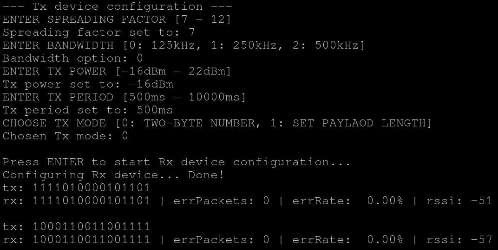

# BER system for Nucleo-WL55JC2 boards

## General info
This project is a simple byte error rate system and its aim is to allow testing receiver radio sensitivity. Project runs on two Nucleo-WL55JC2 boards - Tx and Rx device. Tx device randomly generates payload which is sent to Rx device via radio with LoRa modulation. Rx device after receiving the payload sends it back to Tx device by using UART interface. Tx device calculates BER and prints results to the terminal. 

## Setup 

```
                                         V    V
             --------------------------  |    |  --------------------------
             |        Tx device       |  |    |  |        Rx device       |
             |                        |--|    |--|                        |
   ComPort<--|                        |          |                        |
             |                        |<-------->|                        |
             --------------------------   UART   -------------------------- 
```

## User interface
Project has implemented simple user interface by which devices can be configured. User is able to configure Spreading Factor, Bandwidth, Tx output power, Tx period, set tx mode and choose payload length.



## How to use it?
- rebuild all files and flash projects to the devices
- open terminal (UART Config = 115200, 8b, 1 stopbit, no parity, no flow control)
- reset Tx device
- configure device by user interface
